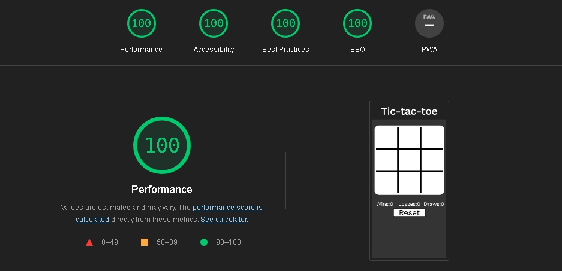

# Tic-tac-toe
This is a site aimed at allowing a user to play tic-tac-toe and track their wins, losses, and draws against a computer opponent. This will be useful for anyone wanting to play the game or practice and improve by tracking their progress.

## Features
- ### Game board
    - Displayed in the center of the page, the game board displays the current state of the game and allows the user to choose their move with a mouse click (or touchsreen tap) on the square of their choice.
    - This is intuitive and visually clear, allowing the user to understand the current state of the game.
    - The JavaScript displays the users move in the correct square, then decides and displays moves to respond.

- ### Scoreboard
    - The scoreboard displays the wins, losses, and draws from the users past games. This allows them to see their progress, and counts their games.
    - This is updated by the JavaScript after every completed game.

- ### Reset Button
    - The Reset button allows the user to reset the board manually, allowing them to restart the current game if they choose to do so. This aids the user by letting them restart if they make a mistake.

## Future Features
- Radio buttons allowing the user to choose to play as "X" or "O".
- The ability to play against another person instead of a computer.

## Testing
- The site has been tested in Firefox, Edge, and Chrome.
- I confirmed the winner resutls are correct.
- I confirmed the site is visually clear and readable for the user.

## Validator testing
- No errors were found when the html was put through the offical W3C validator.
- No errors were found when the css was put through the offical Jigsaw validator.
- No errors were found when the JavaScript was put through the offical JSHint validator.
- I have confirmed the site is accesable with with a lighthouse report.

## Deployment
- Github pages was used to deploy the site live, via the settings tab of the GitHub repository.
- Then choosing the root option under the Branch subheading.
- This resulted in a live site [here.](https://maddiecastle.github.io/tic-tac-toe/)

## Credits
### Contents
- All contents were created by the developer.

### Fonts
- The font used was from google fonts [here.](https://fonts.google.com/specimen/Work+Sans?hl=ru)
